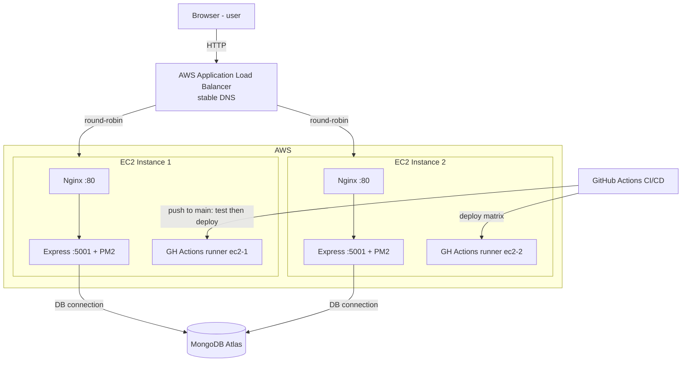

# Section 1 — SRS Documentation

## Purpose

Document what the system does, who it's for, and the constraints around it. Worth 4 marks. Most content carries over from Assignment 1.2 — the HD-specific additions are the accessibility paragraph, the system safety notes, the risk register, and updating the system diagram to show the ALB + two EC2 instances.

> **Scope note:** Assignment 1 defined a full e-commerce set (browse, cart, checkout, orders). The delivered system is an **admin management portal** (products, categories, users — plus customer register/login/profile). The FRs/NFRs below match what is actually built and demonstrated; the deferred commerce features are recorded as Future Work in §1.5 to preserve traceability to the A1 JIRA backlog.

## Subsections Required

### 1.1 Project Overview & Purpose

**Application name:** Petopia Admin

Petopia Admin is a full-stack web application for managing the back-office operations of an online pet supplies shop. Its core purpose is to give store staff a single, reliable interface to maintain the shop's product catalogue, organise it into categories, and oversee the registered customer base — replacing ad-hoc spreadsheets or direct database edits with a controlled, role-secured system.

The application is built as a React single-page front end talking to a Node.js/Express REST API backed by MongoDB. Access is governed by JWT authentication and role-based authorisation, so only users holding the `admin` role can reach management functions. The system is deployed on AWS across two EC2 instances behind an Application Load Balancer, with automated build-and-deploy through a GitHub Actions CI/CD pipeline.

**Intended users:** the primary users are **store administrators** (managers/staff) who create and maintain products and categories and review the customer list. A secondary user type is the **registered customer**, who can register, log in, and manage their own profile — the foundation for a future customer-facing storefront.

### 1.2 Problem Statement & Scope

**Problem.** Pet supplies retailers need an accurate, always-current online catalogue. When product data is maintained manually — across spreadsheets, emails, or direct database changes — updates are slow, error-prone, and impossible to audit. Unauthorised or accidental edits can corrupt pricing and category structure. Petopia Admin solves this by centralising catalogue management behind authenticated, role-controlled CRUD operations with server-side validation and referential safeguards (e.g. a category cannot be deleted while products still reference it).

**In scope (delivered and demonstrated):**
- User registration and JWT-based login/authentication
- Self-service profile view and update
- Admin CRUD for **products**, including name search and category filtering
- Admin CRUD for **categories**, with deletion blocked when products are assigned
- Admin view of the registered **user** list
- Role-based access control (admin vs customer), enforced on every protected route
- Deployment on AWS (two EC2 instances + Application Load Balancer) with automated CI/CD and a health-check endpoint

**Out of scope (explicitly excluded):**
- Customer-facing storefront, product browsing, and shopping cart
- Checkout, payment processing, and order placement / order history
- Admin order management and fulfilment
- Supplier management and automated inventory/stock reconciliation
- Profile deletion / account closure

### 1.3 User Characteristics

| User role | Description & responsibilities | Technical proficiency | Access level |
|---|---|---|---|
| **Administrator** | Store manager or staff member. Creates, edits, and removes products and categories; searches/filters the catalogue; reviews the registered customer list. | Low–moderate. Comfortable with everyday web applications; not expected to know databases, APIs, or the command line. | Full — all management screens (admin role required). |
| **Registered customer** | An end user who has created an account. Can register, log in, and view/update their own profile. | Low. General consumer web literacy only. | Limited — own profile only; no access to admin screens (blocked with HTTP 403). |
| **Unauthenticated visitor** | Any user without a valid session. | Low. | Login and registration pages only; all other routes redirect to login / return HTTP 401. |

Design implications: because both primary user types have low technical proficiency, the UI favours plain-language labels, inline validation, clear text-based error messages, and a simple sidebar layout. The interface is responsive so admin staff can work on tablets as well as desktops.

### 1.4 Constraints

**Technical**
- Runtime requires **Node.js ≥ 18** and **npm ≥ 9**.
- Persistence is **MongoDB (Mongoose 6)**, hosted on MongoDB Atlas (cloud).
- Front end is **React 18 + React Router v6 + Tailwind CSS**; backend is **Express 4**.
- Authentication is stateless **JWT** (30-day tokens); passwords hashed with **bcrypt**.

**Deployment / infrastructure**
- Hosted on AWS **`t2.micro` EC2 instances** (limited CPU/RAM), two instances behind an **Application Load Balancer**.
- Provided through a **university AWS portal**: EC2 instances stop on a ~24-hour cycle and public IPs change on restart, requiring security-group inbound rules (SSH 22, HTTP 80) to be re-added. The stable **ALB DNS name** is therefore used as the public entry point.
- Deployment is automated via **GitHub Actions** to self-hosted runners on each EC2 instance, with **PM2** managing the Node processes.

**Business / project**
- Academic project on a fixed assessment timeline; scope deliberately limited to an admin portal (no commerce flow).
- Single-AZ deployment is acceptable for academic scope (no multi-region/HA requirement).

**Regulatory / security**
- Secrets (`MONGO_URI`, `JWT_SECRET`) must never be committed to source control — kept in `.env` (gitignored) and GitHub Secrets.
- Passwords must never be stored in plaintext.

### 1.5 Functional Requirements

Each requirement is written in "The system shall…" form. The right-hand column traces to the JIRA backlog IDs from Assignment 1.

| ID | Requirement | Traceability |
|---|---|---|
| **FR-01** | The system shall allow a visitor to register an account with a name, email, and password. | PS-1 |
| **FR-02** | The system shall authenticate a registered user from their email and password and return a JWT session token valid for 30 days. | PS-2 |
| **FR-03** | The system shall allow an authenticated user to view and update their own profile. | PS-4 |
| **FR-04** | The system shall allow an admin to create, read, update, and delete categories. | PS-5 |
| **FR-05** | The system shall prevent deletion of a category while one or more products are assigned to it, returning an error instead. | PS-5 |
| **FR-06** | The system shall allow an admin to create, read, update, and delete products, validating that each product references an existing category and that price is non-negative. | PS-6 |
| **FR-07** | The system shall allow an admin to search products by name (case-insensitive) and filter products by category. | PS-7, PS-8 |
| **FR-08** | The system shall allow an admin to view the list of all registered users (name, email, role, created date) without exposing password data. | PS-13 |
| **FR-09** | The system shall restrict admin-only routes to authenticated users holding the admin role, rejecting others. | PS-2, PS-3 |
| **FR-10** | The system shall expose a public health-check endpoint reporting service status and the responding instance ID. | (ops/CI-CD) |

**Future Work (defined in Assignment 1, not in current scope):** customer-facing catalogue browse (PS-9), shopping cart (PS-10), order placement and order history (PS-11, PS-12), and admin order management (PS-14, PS-15). These are deferred to a later phase.

### 1.6 Non-Functional Requirements

| ID | Category | Requirement |
|---|---|---|
| **NFR-01** | Performance | The system shall return standard API responses within **2 seconds** under normal load (**≤ 10 concurrent users**). |
| **NFR-02** | Performance / Scalability | The system shall distribute incoming requests across **two EC2 instances** via the Application Load Balancer. Apache Benchmark (`ab`) confirmed **~467 req/s at concurrency 10** (1,000 requests, ~21 ms mean) and **~205 req/s at concurrency 100** (5,000 requests, ~487 ms mean), with **0 failed requests** in both tests. |
| **NFR-03** | Security | The system shall store user passwords only as **bcrypt** hashes (cost factor ≥ 10); plaintext passwords shall never be persisted or logged. |
| **NFR-04** | Security | The system shall authenticate every protected request via a signed **JWT**, rejecting missing/invalid tokens with **HTTP 401**. |
| **NFR-05** | Security | The system shall reject access by non-admin users to admin routes with **HTTP 403**. |
| **NFR-06** | Security | The system shall keep all secrets in environment variables / GitHub Secrets and exclude them from source control. |
| **NFR-07** | Reliability | The system shall handle errors gracefully without crashing, returning meaningful HTTP status codes and structured JSON error messages. |
| **NFR-08** | Reliability / Availability | The system shall auto-recover from a backend process crash within seconds via **PM2**, and remain reachable through ALB failover if one EC2 instance becomes unhealthy (target ≥ **99% uptime**). |
| **NFR-09** | Usability | The system shall provide a responsive UI usable from **375 px (mobile)** through **1024 px+ (desktop)**, with clear, text-based error messages on every user action. |
| **NFR-10** | Accessibility | The system shall support full keyboard navigation of forms and actions and maintain text/background contrast of at least **WCAG AA 4.5:1**. |
| **NFR-11** | Maintainability | The system shall maintain a passing automated test suite and deploy to both instances within **5 minutes** of a push to `main` via the CI/CD pipeline. |

### 1.7 Low-fidelity wireframes

Generate the low-fidelity frames in an AI UI design tool (e.g. **Google Stitch**, Uizard, or v0). Paste the prompt below, then export the five frames (Login, Dashboard, Product List, Add/Edit Product, Category List) as images into the report.

> **Prompt for Google Stitch (low-fidelity / wireframe mode):**
>
> "Design a low-fidelity wireframe set for **Petopia Admin**, a desktop-first web admin portal for a pet supplies shop. Use a clean, minimal greyscale wireframe style (boxes, placeholder text, no colour or imagery). Responsive layout, 1024px+ desktop primary with a 375px mobile consideration. Generate these five screens:
>
> 1. **Login** — centered card on a plain background. App title '🐾 Petopia — Admin Portal'. Fields: Email, Password. Primary 'Log In' button. A 'No account? Register' text link below.
> 2. **Register** — same centered-card style. Fields: Name, Email, Password. Primary 'Register' button. 'Already registered? Sign in' link.
> 3. **Dashboard** — persistent **left sidebar** (nav items: Dashboard, Products, Categories, Users, Profile, Logout) and a main content area showing three summary stat cards (Products, Categories, Users) with placeholder counts and a 'Welcome back, Admin' heading.
> 4. **Product List** — same sidebar layout. Main area: page title 'Products' with an '+ Add Product' button top-right, a search input and a category filter dropdown, and a data table with columns Name, Category, Price, Stock and per-row Edit / Delete actions.
> 5. **Add / Edit Product** — sidebar layout. A form with fields: Name, Description, Price, Stock, Category (dropdown), Image URL, and Cancel / Save buttons.
>
> Also include a **Category List** variant: a table with columns Name and Product count, an '+ Add Category' button, and per-row Edit / Delete actions where Delete is visibly disabled when the product count is greater than zero. Keep all screens consistent: same sidebar, same table and button styling, sans-serif placeholder text."

### 1.8 System Diagram

Generate the deployment/architecture diagram in a diagram tool that accepts a text prompt (e.g. **Eraser.io DiagramGPT**, **Mermaid**, Excalidraw, or draw.io). The diagram must show the **ALB in the data path** with **two EC2 instances**, plus the CI/CD flow.

> **Prompt for an AI diagram tool (e.g. Eraser DiagramGPT):**
>
> "Create a cloud deployment architecture diagram for **Petopia Admin**. Left to right / top to bottom flow:
>
> - A **Browser (user)** node sends HTTP requests to an **AWS Application Load Balancer (ALB)**, labelled with a stable DNS name.
> - The ALB round-robins traffic to **two EC2 instances** (EC2 Instance 1 and EC2 Instance 2), each in the same VPC.
> - Inside **each** EC2 instance show the same internal stack: **Nginx (:80)** → **Express API (:5001)** managed by **PM2**, and a **GitHub Actions self-hosted runner**.
> - Both EC2 instances connect out to a shared **MongoDB Atlas** database (cloud, outside the VPC).
> - A separate **GitHub Actions (CI/CD)** node: on **push to `main`**, a Test job runs, then a Deploy job fans out via a matrix to the two self-hosted runners (ec2-1 and ec2-2), deploying to both instances.
>
> Use grouped containers: one box for 'AWS' enclosing the ALB and both EC2 instances, MongoDB Atlas as an external cloud node, and GitHub Actions as an external CI/CD node. Label every arrow (HTTP, round-robin, DB connection, deploy)."

**Reference structure** (for the prompt above / a manual fallback):

```
Browser (user)
  ↓ HTTP
ALB (AWS Application Load Balancer)  — stable DNS name
  ↓ round-robin
  ├── EC2 Instance 1
  │     Nginx :80 → Express :5001 → MongoDB Atlas
  │     PM2 (process manager)
  │     GitHub Actions self-hosted runner (ec2-1)
  └── EC2 Instance 2
        Nginx :80 → Express :5001 → MongoDB Atlas
        PM2
        GitHub Actions self-hosted runner (ec2-2)

GitHub Actions (CI/CD)
  ↑ push to main
  Test job (petopia runner)
  Deploy job matrix → ec2-1 runner + ec2-2 runner
```

Optionally render it as **Mermaid** directly (most tools and Markdown viewers support it):



> Update your 1.2 diagram to add the ALB and the second EC2. The diagram must show the load balancer in the data path.

## Accessibility (HD addition)

Petopia Admin targets store staff on desktop browsers. Accessibility considerations include:
- Keyboard navigation for all form inputs and action buttons
- Sufficient colour contrast between text and backgrounds (WCAG AA, minimum 4.5:1)
- Responsive layout for tablet viewports (min-width 768px) — admin staff may use tablets on the shop floor
- Error messages displayed as text (not colour-only) so screen readers can announce them

## System Safety (HD addition)

| Concern | How it's handled |
|---|---|
| Authentication | JWT tokens signed with a secret stored only in GitHub Secrets and the server's `.env` |
| Password storage | bcrypt with cost factor 10 via a Mongoose `pre('save')` hook — never stored in plaintext |
| Secret management | `.env` is gitignored; written at deploy time from GitHub Secrets |
| Process recovery | PM2 auto-restarts Express if it crashes |
| Error handling | All API errors return structured JSON via `ResponseFactory`; unhandled exceptions caught by Express error middleware |

## Risk Register (HD addition)

| Risk | Likelihood | Impact | Mitigation |
|---|---|---|---|
| EC2 public IP changes on restart | High (daily at uni) | Low | ALB DNS is stable; SSH via EC2 Instance Connect (no fixed IP needed) |
| Exposed secrets in repo | Low | High | `.env` gitignored; all secrets in GitHub Secrets |
| Unauthorised admin access | Low | High | JWT + `adminCheck` middleware on all admin routes |
| Database unavailable | Low | High | Mongoose connection errors caught and returned as 500; PM2 restarts backend |
| Both instances fail simultaneously | Very low | High | Independent EC2s — single-AZ deployment; acceptable for academic scope |
